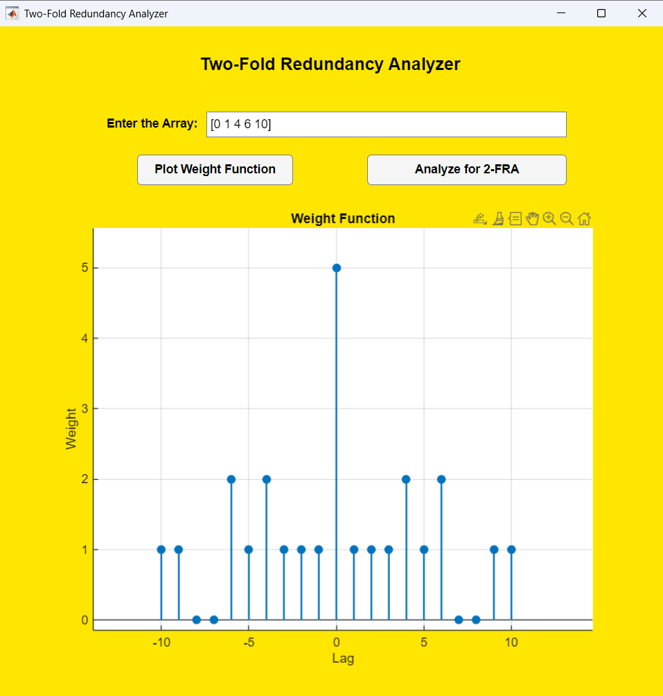

# RMRA Two-Fold Redundancy Analyzer

A MATLAB-based interactive tool for analyzing true two-fold redundancy
in sparse sensor arrays and detecting hidden essential sensors.

## App Screenshot

Screenshot of the RMRA Two-Fold Redundancy Analyzer showing the weight
function visualization and redundancy analysis interface.

## Features
- Difference coarray and weight function visualization
- Double difference array validation
- Fragility (2/N) analysis
- Hidden essential sensor detection

## Requirements
- MATLAB R2021a or later
- Signal Processing Toolbox

## How to Run
RMRA_TwoFoldAnalyzer

## Example Input
[0 1 4 6 10]
